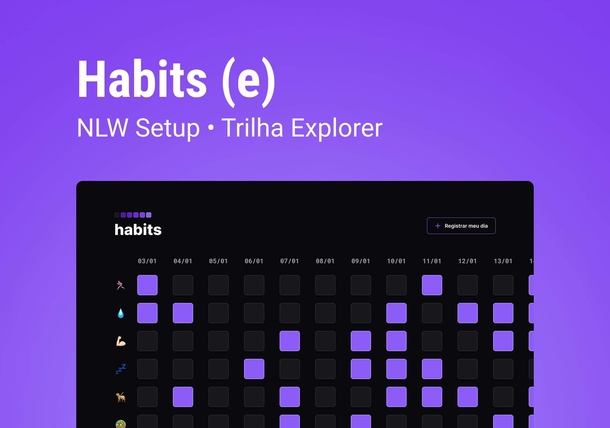

<h1 align="center">Habits</h1>

 O Habits é um app para ajudar a rastrear os hábitos. 

<a align="center">
    <a href="#=tecnologias">Tecnologias</a>&nbsp;&nbsp;&nbsp;|&nbsp;&nbsp;&nbsp;
    <a href="#=projeto">Projeto</a>&nbsp;&nbsp;&nbsp;|&nbsp;&nbsp;&nbsp;
    <a href="#=layout">Layout</a>&nbsp;&nbsp;&nbsp;|&nbsp;&nbsp;&nbsp;
    <a href="#=memo-licença">Licença</a>&nbsp;&nbsp;&nbsp;|&nbsp;&nbsp;&nbsp;

    

## 🚀 Tecnologias

Esse projeto foi desenvolvido com as seguintes tecnologias:

- HTML e CSS
- JavaScript
- Git e Github
- Figma

## 💻 Projeto

Visite [aqui](https://brendathena.github.io/RocketSeat-Habits) a versão final do projeto.

## 🔖 Layout

Você pode visualizar o layout do projeto através [DESSE LINK](https://www.figma.com/community/file/1195327109778210238). É necesário ter conta no [Figma](https://figma.com)

## 📝 Licença

Esse projeto está sob a licença MIT

Habits é um webapp produzido no evento NLW.
O NWL é um evento exclusivo e gratuito, promovido pela [RocketSeat](https://www.rocketseat.com.br) para ensino de tecnologias WEB.
💜[Participe da nossa comunidade](https://discorg.gg/rocketseat)💜